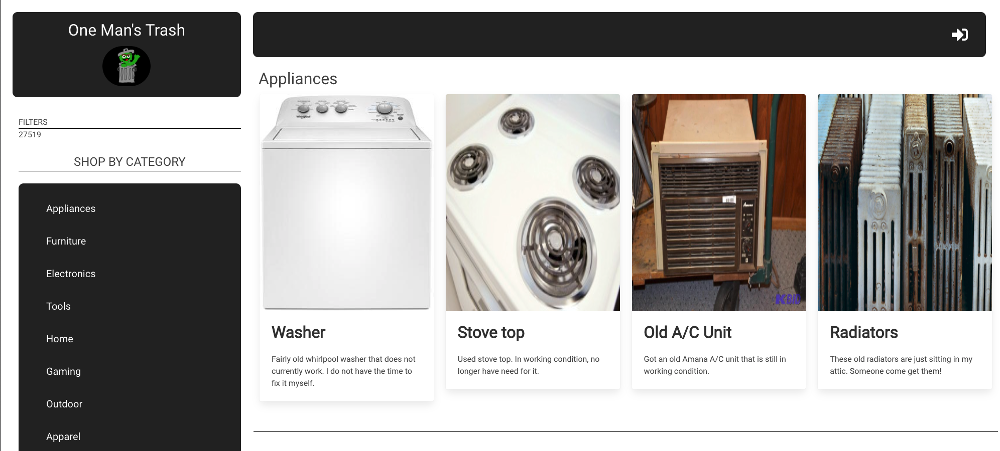
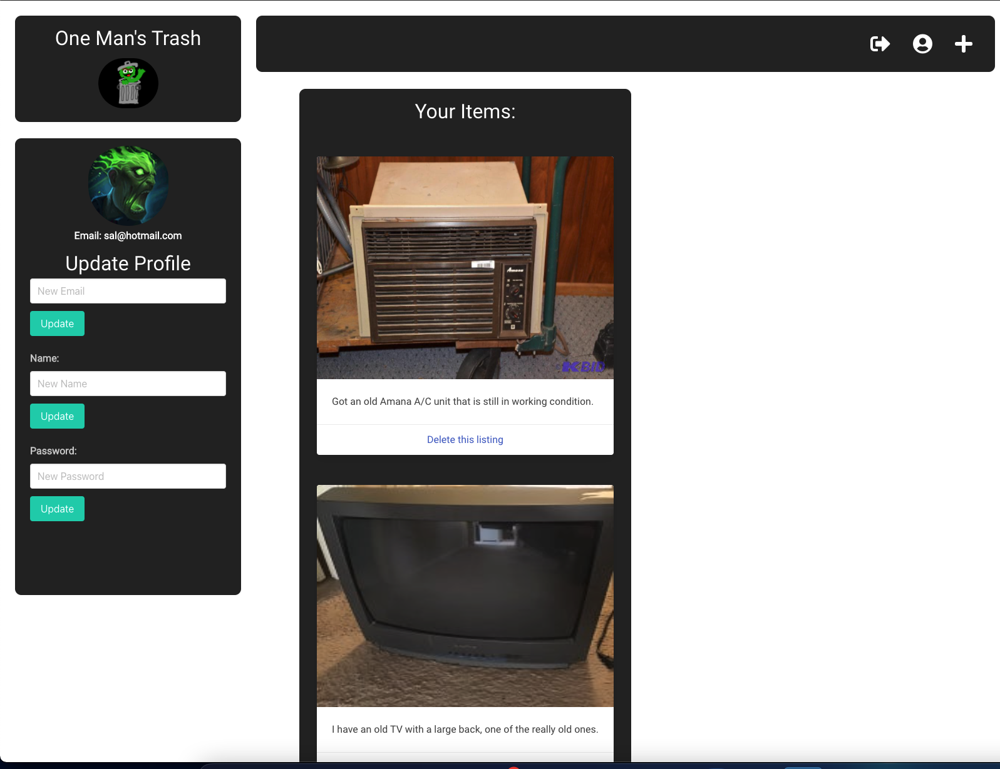
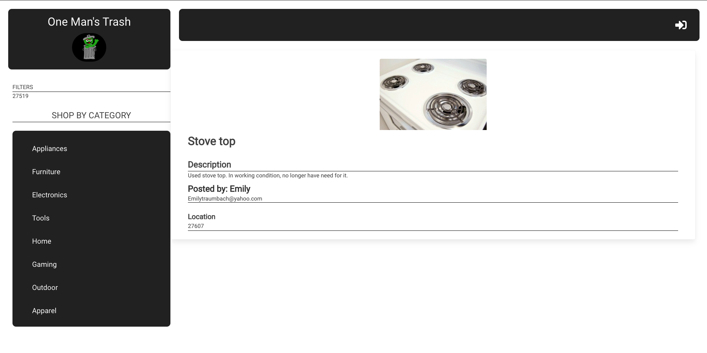
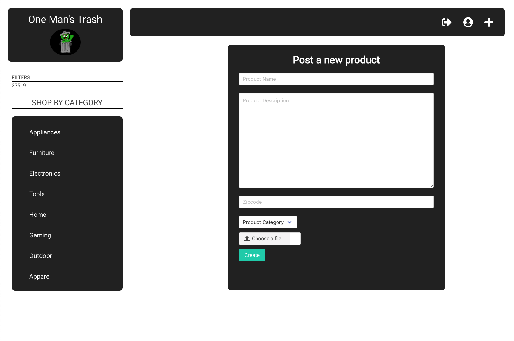

# One Man's Trash

---
[](https://opensource.org/licenses/MIT)

## See The Live App Here:

- [One Man's Trash](https://one-mans-trash-project.herokuapp.com/)

## Table of Contents:
- [Description](#description)
- [Installation](#installation)
- [Technologies](#technologies)
- [Usage](#usage)
- [Screenshots](#screenshots)
- [Credits](#credits)

---

## Description:

One Man’s Trash is a web application for giving away things you no longer need. Rather than throwing unwanted items away in the garbage to eventually end up in a landfill, One Man’s Trash lets users give away their items for others to repurpose and reuse however they see fit.

One man’s trash is another man’s treasure!
 
---

## Technologies:
```
- Javascript
- Node
- Insomnia
- Sequelize 
- Multer
- Datauri
- Cloudinary
- Bulma
- Handlebars
- SQL
- Express
- Heroku
```

---

## Installation: 
```
Clone the repo and then run npm install in an integrated terminal. 
Run mysql -u root -p 
Source db/schema.sql
exit 
in the same integrated terminal run npm run seed
then run npm start

``` 

---

## Usage: 

One Man’s Trash lets individuals give away and receive unwanted items. There is never a cost involved - everything is free. To post an item to give away, users must first create an account, and are then able to post an item with a description, zip code, category, and an uploaded image. Users can view which available items they’ve posted via their profile page, and can delete an item when it has been claimed. Users can also update their profile settings (username, email, password) via this page. If users see an item they’d like, they can contact the poster via their provided email address to arrange for pickup.

---

## Screenshots:

### **Application Homepage**
---

### **Login or Sign-up**
---

### **User Profile**
---

### **Selected Product** 
---

### **User Item Post**
---


---

## Credits 

- [Will Berner](https://github.com/WillBerner)
- [Joey Swafford](https://github.com/joeyswafford)
- [Cody Van Buren](https://github.com/bvanburenwx)